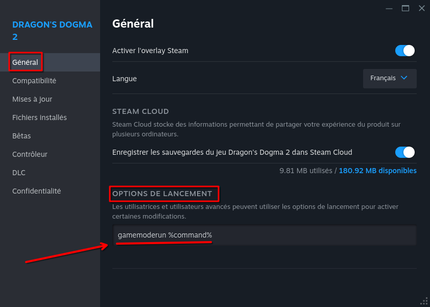

# Astuces diverses

Si vous avez une astuce non répertoriée ou que au contraire vous notez que une astuce n'est plus utile merci de me le signaler.

Autre documentation complémentaire et **imporatante à lire** avec des **[Astuces spécifiques à certains jeux](https://github.com/Cardiacman13/astuces-jeux)**

## **Table des Matières**

1. **[Performance à Attendre des Jeux Selon Votre Configuration Matérielle](#performance-à-attendre-des-jeux-selon-votre-configuration-matérielle)**
2. **[Discord Demande une Mise à Jour non Disponible dans le Répertoire](#discord-demande-une-mise-à-jour-non-disponible-dans-le-répertoire)**
3. **[Configuration du Multiboot avec grub](#configuration-du-multiboot-avec-grub)**
4. **[Accéder à un disque secondaire avec une application FLATPAK](#accéder-à-un-disque-secondaire-avec-une-application-flatpak)**
5. **[Comment créer une clé bootable depuis Windows](#comment-créer-une-clé-bootable-depuis-windows)**
6. **[Problème de Performance avec les CPU Intel de 12ᵉ Génération et Plus](#problème-de-performance-avec-les-cpu-intel-de-12ᵉ-génération-et-plus)**
7. **[Problème de Performance avec BAR ou SAM](#problème-de-performance-avec-bar-ou-sam)**
8. **[Gamemode](#gamemode)**
9. **[Amélioration des Performances avec PROTON_HIDE_NVIDIA_GPU](#amélioration-des-performances-avec-proton_hide_nvidia_gpu)**
10. **[Problème de Performance avec les CPU Intel ayant des e-cores](#problème-de-performance-avec-les-cpu-intel-ayant-des-e-cores)**

---

<a name="performance-à-attendre-des-jeux-selon-votre-configuration-matérielle"></a>
## Performance à Attendre des Jeux Selon Votre Configuration Matérielle

Si vous avez un CPU Intel de 12ᵉ génération ou plus, soyez attentif aux problèmes du splitlock mitigate et des E-cores, abordés dans les chapitres 6 et 10 de cette page.

1. **PC avec GPU AMD ** :
   - **Avantage** : La plupart des jeux fonctionnent généralement mieux sous Linux que sous Windows, y compris les jeux DirectX 12, **excepté pour le Ray Tracing quand il est implémenté avec des technologies de Nvidia**. Le driver MESA est installé par défaut sur toutes les distributions, ce qui permet une compatibilité immédiate.
   - **Exception** : Le Ray Tracing façon Nvidia est mal optimisé sous Linux (SDK RTX alors que le standard c'est DXR, DirectX Raytracing), et tous les jeux avec cette fonctionnalité, si on l'active auront de meilleures performances sous Windows.

2. **PC avec GPU Nvidia RTX et 16xx** :
   - **Avantage** : Les jeux natifs, utilisant Vulkan, DirectX 11 et les versions DirectX antérieures à DX11 fonctionnent souvent aussi bien, voire mieux, sous Linux que sous Windows. Surtout au niveaux des FPS mini et donc moins de stutter + de stabilité.
   - **Limitation** : À l'heure actuelle, la majorité des jeux DirectX 12 obtiennent de largement meilleures performances en termes de FPS moyens sous Windows ([Topic du forum Nvidia sur les performances "terribles" avec DX12](https://forums.developer.nvidia.com/t/directx12-performance-is-terrible-on-linux/303207/28)), bien que les FPS minimums (1% low) soient parfois, pour certains jeux, plus stables sous Linux.
   - **Difficulté** : L'installation des drivers Nvidia sous Linux peut être complexe. Ils sont moins bien implémentés que les drivers AMD et Intel.

3. **PC avec GPU Intel ARC (A770, A750, etc.)** :  
   - **Avantage** : Pour les titres DirectX 11 ou plus anciens, le driver DXVK intégré offre de bonnes performances. Les jeux Vulkan, Java tournent généralement sans problème notable.  
   - **Limitation** : Les performances avec DirectX 12 restent problématiques. De nombreux jeux nécessitent un "spoof" (Consiste à faire croire à un logiciel ou un matériel qu'il interagit avec un autre matériel ou environnement que celui réellement utilisé. ) pour que le GPU soit reconnu comme un AMD afin de contourner des chemins spécifiques au driver propriétaire Windows, ce qui peut résoudre certains problèmes de compatibilité. Cependant, cela reste un bricolage avec des résultats variables.  
   - **Incompatibilité** : Certains titres DX12, comme *Marvel's Spider-Man Remastered* ou *Hogwarts Legacy*, peuvent ne pas se lancer ou présenter des bugs majeurs sans [correctifs spécifiques](https://gitlab.freedesktop.org/mesa/mesa/-/merge_requests/24194).  
   - **Difficulté** : La partie du driver MESA pour Intel ARC est encore jeune, et sa stabilisation nécessite davantage de ressources et de développement, or il y a peu de monde pour s'en occuper, ce qui peut poser des défis pour les utilisateurs souhaitant une expérience de jeu sans encombre.
   
   Enfin, avec des cartes Nvidia plus anciennes (génération Pascal GTX 10XX et antérieures), ne vous attendez pas à de bonnes performances sous DirectX 12 sur Linux en plus des problèmes coté driver et VKD3D s'ajoutent [des problèmes hardware qui ne seront jamais corrigés](https://github.com/HansKristian-Work/vkd3d-proton/issues/465#issuecomment-744092867).  

**Résumé général** : Sous Linux, le choix du GPU joue un rôle crucial. Les utilisateurs AMD bénéficient du meilleur équilibre entre compatibilité, performance, et simplicité d'utilisation grâce au driver MESA, bien qu'ils subissent des limitations avec le Ray Tracing dans certains jeux optimisés Nvidia. Les utilisateurs Nvidia doivent composer avec de mauvaises performances sur DirectX 12 et des challenges liés aux drivers propriétaires. Enfin, les utilisateurs Intel ARC profitent des innovations open source, mais doivent être prêts à affronter les aléas d'une intégration jeune et en pleine évolution.
 

---

<a name="discord-demande-une-mise-à-jour-non-disponible-dans-le-répertoire"></a>
## Discord Demande une Mise à Jour non Disponible dans le Répertoire

Discord refusera de se lancer s'il détecte qu'une mise à jour est disponible, affichant le message suivant : "Must be your lucky day, there's a new update !" (C'est votre jour de chance, une nouvelle mise à jour est disponible !). Si la version mise à jour n'est pas encore disponible dans les répertoires officiels de votre distribution, vous pouvez soit utiliser les Flatpak, soit désactiver la vérification de mise à jour.

Pour désactiver la vérification de mise à jour, ajoutez la ligne suivante à `~/.config/discord/settings.json` :

```bash
nano ~/.config/discord/settings.json
```

```json
"SKIP_HOST_UPDATE": true
```

Notez que vous devrez ajouter une virgule supplémentaire après le dernier élément en raison des exigences du format JSON, par exemple :

```json
{
  "IS_MAXIMIZED": true,
  "IS_MINIMIZED": false,
  "WINDOW_BOUNDS": {
    "x": 2240,
    "y": 219,
    "width": 1280,
    "height": 720
  },
  "SKIP_HOST_UPDATE": true
}
```

---

<a name="configuration-du-multiboot-avec-grub"></a>
## Configuration du Multiboot avec grub

#### Introduction

Le multiboot est un moyen de démarrer plusieurs systèmes d'exploitation sur un même ordinateur. Dans ce tutoriel, nous allons utiliser GRUB, le gestionnaire de démarrage standard pour de nombreuses distributions Linux, pour configurer un multiboot.

Selon l'OS il faudra monter la partition fat ou se trouve son boot avant de lancer os-prober. Vous pouvez utiliser gnome-disk ou partitionmanager pour ça.

1. **Modifier la Configuration de GRUB** :

   Ouvrez un terminal et exécutez la commande suivante pour ouvrir le fichier de configuration de GRUB :

   ```bash
   sudo nano /etc/default/grub
   ```

   Recherchez la ligne contenant `# GRUB_DISABLE_OS_PROBER=false` et supprimez le caractère `#` au début de la ligne pour activer la détection automatique d'autres systèmes d'exploitation.

   Si vous voulez également que votre GRUB mémorise le dernier OS lancé, remplacez la ligne `GRUB_DEFAULT=0` par `GRUB_DEFAULT=saved` et ajoutez `GRUB_SAVEDEFAULT="true"`.

   Enregistrez les modifications et quittez l'éditeur de texte.

2. **Installer `os-prober`** :

   Utilisez votre gestionnaire de paquets pour installer `os-prober`, un utilitaire qui permet à GRUB de détecter d'autres systèmes d'exploitation :

   Base Arch :

   ```bash
   sudo pacman -S os-prober
   ```

   Base Fedora :

   ```bash
   sudo dnf install os-prober
   ```

   Base Debian/Ubuntu :

   ```bash
   sudo apt install os-prober
   ```

3. **Exécuter `os-prober`** :

   Exécutez `os-prober` pour rechercher d'autres systèmes d'exploitation installés sur votre ordinateur :

   ```bash
   sudo os-prober
   ```

4. **Générer la Configuration de GRUB** :

   Utilisez la commande suivante pour générer la configuration de GRUB basée sur les résultats de `os-prober` :

   Sur base Arch :

   ```bash
   sudo grub-mkconfig -o /boot/grub/grub.cfg
   ```

   Sur base Fedora :

   ```bash
   grub2-mkconfig -o /boot/grub2/grub.cfg
   ```

   Sur base Ubuntu :

   ```bash
   sudo update-grub
   ```

---

<a name="accéder-à-un-disque-secondaire-avec-une-application-flatpak"></a>
## Accéder à un disque secondaire avec une application Flatpak

**Attention** : Certains Flatpak, comme celui de Steam, refusent de se lancer si on leur donne accès à tous les dossiers. Il faut donc uniquement donner à Steam Flatpak l'accès aux bibliothèques de jeu.

Le plus simple est d'utiliser **Flatseal**. Sélectionnez le Flatpak concerné, cliquez sur .

Ajoutez le chemin où vous montez vos disques durs / SSD secondaires. `/media` ou `/mnt` sont recommandés pour cet usage.


Il faut fermer Flatseal et redémarrer le Flatpak concerné pour appliquer la modification.

---

<a name="comment-créer-une-clé-bootable-depuis-windows"></a>
## Comment créer une clé bootable depuis Windows

Tuto côté Emmabuntüs : [Installer Emmabuntüs DE5 - Avec l'outil Etcher](https://emmabuntus.org/installer-emmabuntus-de5/#Avec_loutil_Etcher)

---

<a name="problème-de-performance-avec-les-cpu-intel-de-12ᵉ-génération-et-plus"></a>
## Problème de Performance avec les CPU Intel de 12ᵉ Génération et Plus

### Contexte

En 2020, le noyau Linux a introduit un détecteur de *split-locks* (verrous fractionnés). Un *split-lock* se produit lorsqu'une instruction atomique s'étend sur plusieurs lignes de cache, nécessitant un verrou global du bus. Ces opérations sont coûteuses, prenant au moins mille fois plus de cycles qu'une opération atomique normale. Pour informer les utilisateurs, le détecteur rapportait ces incidents dans les journaux du noyau.

Cependant, à partir de Linux 5.19, les développeurs du noyau ont décidé de **ralentir intentionnellement** les applications mal conçues qui abusent des *split-locks*. L'objectif était de "rendre la vie misérable" à ces applications en forçant un accès séquentiel, tout en maintenant la réactivité du reste du système. Bien que cette approche puisse encourager les développeurs open-source à améliorer leur code, elle pose des problèmes pour les logiciels propriétaires ou non maintenus, notamment certains jeux Windows exécutés via Steam Play.

### Cas Pratique : God of War

Un exemple notable est le jeu **God of War**. [Les utilisateurs ont signalé des performances extrêmement faibles lors de son exécution](https://github.com/doitsujin/dxvk/issues/2938) sur Linux 5.19 et plus. En investiguant, il a été découvert que le jeu abusait des *split-locks*, entraînant le ralentissement intentionnel par le noyau. En désactivant la détection des *split-locks* au démarrage du noyau avec l'option `split_lock_detect=off`, les performances du jeu s'amélioraient considérablement.

### Solution Apportée dans Linux 6.2+

Pour remédier à ces problèmes, Linux 6.2 a introduit un nouveau paramètre **`split_lock_mitigate`** via `sysctl`. Ce paramètre permet aux utilisateurs de contrôler plus facilement le comportement du noyau vis-à-vis des *split-locks* sans nécessiter de redémarrage.

- **`split_lock_mitigate=1` (par défaut)** : Active le mode "misère", ralentissant les applications utilisant des *split-locks*.
- **`split_lock_mitigate=0`** : Désactive le ralentissement, ne laissant qu'un avertissement dans le journal du noyau.

Cette flexibilité permet, par exemple, à des outils comme **Feral's GameMode** ou des distributions spécifiques au gaming (comme Bazzite ou Nobara) d'ajuster ce paramètre.
 

### Options pour Désactiver la Détection des *Split-Locks*

#### Option (a) : Modification Permanente des Paramètres au Démarrage

Si vous souhaitez désactiver la détection des *split-locks* de manière permanente :

1. **Créer un fichier de configuration** :

   ```bash
   echo "kernel.split_lock_mitigate=0" | sudo tee /etc/sysctl.d/99-split-lock.conf
   ```

2. **Redémarrer le Système**.

3. **Vérifier la Désactivation** :

   ```bash
   sysctl -a | grep split
   ```

   Vous devriez voir que `kernel.split_lock_mitigate` est défini sur `0`.

#### Option (b) : Désactivation Temporaire avec `sysctl`

Pour une désactivation temporaire (effective immédiatement mais nécessitant une réapplication après chaque redémarrage) :

1. **Exécuter la Commande** :

   ```bash
   sudo sysctl kernel.split_lock_mitigate=0
   ```

2. **Vérifier la Désactivation** :

   ```bash
   sysctl -a | grep split
   ```

#### Option (c) : Utiliser **GameMode**

**GameMode** peut automatiser la désactivation des *split-locks* pendant les sessions de jeu. Par défaut, il est configuré pour gérer cette option.

- **Configuration de GameMode** : Le fichier de configuration par défaut de GameMode (ligne 42) peut être modifié si nécessaire. Voir le dépôt officiel : [gamemode.ini](https://github.com/FeralInteractive/gamemode/blob/master/example/gamemode.ini).

- **Pour en savoir plus**, consultez le [chapitre sur GameMode](https://codeberg.org/Gaming-Linux-FR/glf-astuces#gamemode).

#### Liens utiles :

- [Discussion sur GitHub - Problème de détection de verrouillage fractionné](https://github.com/doitsujin/dxvk/issues/2938)
- [Article sur Phoronix - Impact du verrouillage fractionné sur les jeux Linux](https://www.phoronix.com/news/Linux-Splitlock-Hurts-Gaming)

### Résultats

Après avoir désactivé la détection de verrouillage fractionné, vous devriez remarquer une amélioration significative des performances de votre jeu. Si vous avez suivi ces étapes correctement, votre jeu devrait maintenant fonctionner de manière fluide et sans les chutes de FPS précédentes. Sur ma machine, par exemple dans God Of War, je passe de 40 fps à 150 fps.

---

<a name="problème-de-performance-avec-bar-ou-sam"></a>
## Problème de Performance avec BAR ou SAM

Certains jeux perdent énormément de performances si on ne désactive pas SAM / BAR avec l'option de lancement `VKD3D_CONFIG=no_upload_hvv`. Voici le [lien](https://github.com/HansKristian-Work/vkd3d-proton/issues/1406#issuecomment-2014752410) vers l'issue pour suivre l'évolution du bug et voir les jeux concernés, entre autres :

- World of Warcraft
- Uncharted 4
- Spider-Man / Spider-Man Miles Morales
- Resident Evil 2 Remake, Resident Evil Village, Dragon's Dogma 2 et autres jeux Capcom récents
- Age of Empires 4
- Death Stranding
- ...

---

<a name="gamemode"></a>
## Gamemode

[Vidéo de présentation](https://youtu.be/UkM0EMk5Xkc?si=cWcmbCATQ9HknmVh)

GameMode est une combinaison démon/bibliothèque pour Linux qui permet aux jeux de demander qu'un ensemble d'optimisations soit temporairement appliqué au système d'exploitation hôte et/ou à un processus de jeu.

GameMode a été conçu principalement comme une solution temporaire aux problèmes avec les gouverneurs d'économie d'énergie ou à la demande des processeurs Intel et AMD, mais il héberge désormais une gamme de fonctionnalités et de configurations d'optimisation.

Actuellement, GameMode inclut la prise en charge des optimisations suivantes :

- Gouverneur CPU
- Priorité d'E/S
- Optimisation des processus
- Planificateur de noyau (SCHED_ISO)
- Inhibition de l'économiseur d'écran (désactive la mise en veille)
- Mode de performance GPU (NVIDIA et AMD), overclocking GPU (NVIDIA)
- Affectation ou mise en veille des cœurs CPU
- Scripts personnalisés

Les paquets GameMode sont disponibles pour Ubuntu, Debian, Solus, Arch, Gentoo, Fedora, OpenSUSE, Mageia et peut-être plus.

On l'installe par exemple en faisant : `sudo apt install gamemode` sur base Debian/Ubuntu. Il faut ensuite s'ajouter au groupe en faisant `sudo usermod -aG gamemode $(whoami)`, puis on peut vérifier avec `gamemoded -t` que tout s'est bien passé.

> **Attention** : GameMode est très utile sur les distributions non orientées gaming. Cependant, sur des distributions comme Bazzite ou CachyOS, il est déconseillé car il peut entrer en conflit avec les optimisations déjà présentes.



Sur Lutris, c'est une case à cocher.


Pensez bien à sauvegarder !

### Installation de GameMode sur ArchLinux

> **Attention** : La plupart des distributions configurent GameMode automatiquement. Cependant, sur Arch, les distributions basées sur Arch, et peut-être d'autres distributions DIY (Do It Yourself), vous devrez le configurer vous-même. Consultez le [wiki.archlinux.org/title/Gamemode](https://wiki.archlinux.org/title/Gamemode) : Installez les paquets, ajoutez-vous au groupe `gamemode`, et créez le fichier de configuration. Sinon, GameMode ne fera rien.

#### Étape 1 : Installation des paquets

Pour commencer, installez les paquets nécessaires `gamemode` et `lib32-gamemode` en utilisant `pacman` :

```bash
sudo pacman -S gamemode lib32-gamemode
```

#### Étape 2 : Ajout de l'utilisateur au groupe `gamemode`

Ajoutez votre utilisateur au groupe `gamemode` pour permettre au démon de GameMode de modifier le gouverneur du CPU et la priorité des processus :

```bash
sudo usermod -aG gamemode $(whoami)
```

#### Étape 3 : Configuration de GameMode

GameMode est configuré à l'aide de fichiers `gamemode.ini`. Ceux-ci sont lus et fusionnés dans l'ordre suivant :

1. `/etc/gamemode.ini` pour la configuration système.
2. `$XDG_CONFIG_HOME/gamemode.ini` pour la configuration utilisateur locale.
3. `./gamemode.ini` pour la configuration locale au répertoire.

##### Exemple de configuration

Pour créer un fichier de configuration, par exemple dans `/etc/gamemode.ini`, utilisez l'exemple fourni par Feral Interactive :

```bash
sudo nano /etc/gamemode.ini
```

Copiez et collez l'exemple de configuration disponible sur le [GitHub de Feral Interactive](https://github.com/FeralInteractive/gamemode/blob/master/example/gamemode.ini). N'oubliez pas de sauvegarder le fichier une fois les modifications terminées.

---

<a name="amélioration-des-performances-avec-proton_hide_nvidia_gpu"></a>
## Amélioration des Performances avec PROTON_HIDE_NVIDIA_GPU

### Contexte

Certains jeux DirectX 12 sur Linux peuvent présenter des problèmes de performances lorsqu'ils sont exécutés avec des GPU Nvidia. Une solution pour améliorer ces performances consiste à utiliser la variable d'environnement `PROTON_HIDE_NVIDIA_GPU=1`.

### Utilisation

En ajoutant `PROTON_HIDE_NVIDIA_GPU=1 %command%` dans les options de lancement du jeu, vous pouvez observer une amélioration significative des performances et de la stabilité dans plusieurs jeux DirectX 12, tels que **Final Fantasy XVI** et **Dragon's Dogma 2**, sur Linux avec des cartes graphiques Nvidia.

**Note importante** : Cette commande désactive certaines fonctionnalités spécifiques aux GPU Nvidia, comme le **DLSS** et **Reflex**. Même en désactivant manuellement ces options dans les paramètres du jeu, il est possible que vous n'obteniez pas le même gain de performances qu'en utilisant cette variable d'environnement.

### Résultats Observés

- **Amélioration des FPS** : Une augmentation notable des images par seconde, en particulier dans les zones avec beaucoup d'IA, comme les villes et les villages. Dans certains cas, le FPS peut être doublé.
- **Stabilité du Framerate** : Le taux de trame devient plus stable, réduisant les saccades et les baisses soudaines de performances.
- **Zones Concernées** : L'amélioration est particulièrement visible dans les zones densément peuplées ou graphiquement intenses. Dans les zones moins exigeantes, la différence peut être moins perceptible.

### Limitations

- **Perte de Fonctions Nvidia** : Comme mentionné, des fonctionnalités comme le DLSS (Deep Learning Super Sampling) et Nvidia Reflex seront désactivées.
- **Écart avec Windows** : Malgré cette optimisation, les performances dans les jeux DirectX 12 peuvent rester inférieures de 15% à 40% par rapport à l'exécution sous Windows.

### Mise en Œuvre

1. **Ouvrir les Propriétés du Jeu** : Dans Steam, faites un clic droit sur le jeu concerné et sélectionnez "Propriétés".
2. **Ajouter l'Option de Lancement** : Dans le champ "Options de lancement", ajoutez la ligne suivante :

   ```
   PROTON_HIDE_NVIDIA_GPU=1 %command%
   ```

### Conclusion

Cette astuce peut transformer des zones auparavant injouables en expériences fluides. Utile pour les joueurs utilisant des GPU Nvidia sur Linux et rencontrant des problèmes de performances avec des jeux DirectX 12. Bien que certaines fonctionnalités soient désactivées, le gain en fluidité peut largement compenser cette perte.

**Note** : Cette astuce est applicable à d'autres jeux DirectX 12 et peut être testée sur différents titres pour voir si des améliorations similaires sont observées.

---

Voici le bloc de texte formaté que tu peux insérer dans ton guide. J'ai respecté ta structure (ancres, liens internes et mise en forme Markdown).

Tu peux l'ajouter à la suite de ton document, et n'oublie pas de mettre à jour le lien dans la **Table des Matières** (point n°10).

---


## Problème de Performance avec les CPU Intel ayant des e-cores

### Contexte

Depuis la 12ᵉ génération (Alder Lake), Intel utilise une architecture hybride combinant des **P-cores** (Performance) et des **E-cores** (Efficacité). Sous Linux, bien que le scheduler (planificateur) se soit amélioré, il arrive encore que le système envoie par erreur des tâches lourdes (le moteur du jeu ou le traitement audio) sur les E-cores, beaucoup moins puissants. Certains jeux utilisent très bien tous les coeurs et fonctionnent mieux avec tous les coeurs donc c'est a n'utiliser seulement si on note un problème.

**Symptômes courants :**

* Chutes brutales de FPS (stuttering).
* Craquements, grésillements ou décalages du son en jeu.
* Performances globales bien inférieures à celles attendues.

### Solutions pour corriger le problème

#### 1. Utiliser GameMode pour "pin" les P-cores

C'est la solution la plus élégante car elle est automatique et ne nécessite pas de redémarrage. Vous pouvez configurer **GameMode** pour qu'il force le jeu à n'utiliser que les cœurs de performance (P-cores) et ignore les E-cores.

* **Configuration :** Dans votre fichier `gamemode.ini` (généralement dans `~/.config/` ou `/etc/`), utilisez la section `[custom]`, utilisez l'option `pin_cores=`. Les P-cores sont toujours les premiers si vous en avez 8 il faudra mettre `pin_cores=0-15` pour pin les 16 premiers threads de votre cpu (en suposant que chaque P-cores et 2 threads à vous de vérifier tout ça).

#### 2. Désactiver les E-cores dans le BIOS

C'est la solution radicale. En désactivant les E-cores directement dans les paramètres de votre carte mère, votre processeur se comportera comme un CPU classique composé uniquement de P-cores.

* **Avantage :** Plus aucun conflit possible, stabilité maximale.
* **Inconvénient :** Vous perdez les bénéfices du multitâche en bureautique, votre CPU consommera potentiellement plus d'énergie sur les tâches simples, ça s'appliquera sur tous les jeux alors que certains les utilisent très bien sans problème, perte de perf par rapport à la solution 1 et 3 ou les E-cores restent actifs pour les tâches en arrière plan laissant encore plus de puissance aux P-cores pin au jeu en cours.

#### 3. Utiliser des outils de gestion de cœurs (CoreCtrl ou CPUPower)

Certains outils permettent de définir des profils par application.

* Avec **CoreCtrl**, vous pouvez créer un profil pour votre jeu qui désactive les cœurs spécifiques au moment du lancement.
* L'utilisation de scripts via `taskset` dans les options de lancement Steam est également très efficace. Par exemple, pour un i9-14900HX (8 P-cores / 16 threads), vous pourriez lancer votre jeu avec :
```bash
taskset -c 0-15 %command%
```

*(Même chose que pour le gamemode à vous de vérifier combien de threads pin selon votre CPU).*

#### 4. Utiliser un scheduler qui règle le problème

Regardez cette vidéo : https://www.youtube.com/watch?v=PsqwImr0Rnc 

Flash en mode low latency règle les problèmes chez moi, mais hélas certains jeux ne l'aime pas donc je trouve ça moins élégant que d'utiliser le gamemode ou taskset 

---
